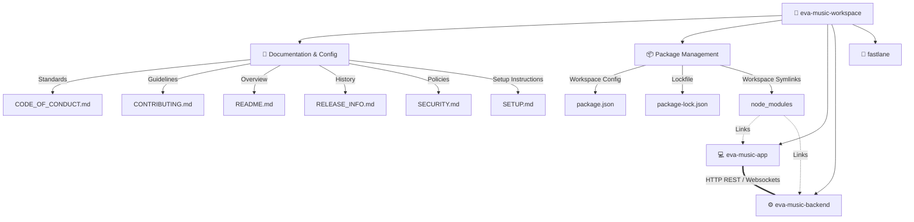

# 🗺️ EVA Music Workspace & Architecture Guide

This document serves as the central architectural blueprint and connection guide for the **EVA Music** project. It outlines the role of every workspace asset and explains exactly how the Frontend and Backend connect and communicate.

---

## 🏗️ Workspace Directory Map

Below is a structured map of the workspace files and directories:



---

## 🗂️ Component & File Reference

Here is a breakdown of what every file and folder in the workspace does:

| Path | Type | Responsibility / Description |
| :--- | :--- | :--- |
| [package.json](file:///d:/all/ai%20agent/eva%20music/package.json) | File | Root workspaces configuration linking the frontend and backend into a monorepo. |
| [package-lock.json](file:///d:/all/ai%20agent/eva%20music/package-lock.json) | File | Dependency tree lockfile ensuring deterministic workspace installations. |
| [node_modules/](file:///d:/all/ai%20agent/eva%20music/node_modules) | Folder | Houses third-party dependencies and local symlinks (`eva-music-app` & `eva-music-backend`). |
| [README.md](file:///d:/all/ai%20agent/eva%20music/README.md) | File | Main project overview, features summary, and quick-start instructions. |
| [SETUP.md](file:///d:/all/ai%20agent/eva%20music/SETUP.md) | File | Step-by-step developer environment setup guide, environment configs, and port configurations. |
| [CONTRIBUTING.md](file:///d:/all/ai%20agent/eva%20music/CONTRIBUTING.md) | File | Guidelines for styling, pull requests, issue handling, and coding standards. |
| [CODE_OF_CONDUCT.md](file:///d:/all/ai%20agent/eva%20music/CODE_OF_CONDUCT.md) | File | Community standards, expectations, and reporting procedures. |
| [SECURITY.md](file:///d:/all/ai%20agent/eva%20music/SECURITY.md) | File | Privacy & data policy details and vulnerability reporting protocols. |
| [RELEASE_INFO.md](file:///d:/all/ai%20agent/eva%20music/RELEASE_INFO.md) | File | Release notes, milestones, and version history. |
| [eva-music-app/](file:///d:/all/ai%20agent/eva%20music/eva-music-app) | Folder | Frontend React 19 Client application utilizing Vite, Howler.js, and TailwindCSS. |
| [eva-music-backend/](file:///d:/all/ai%20agent/eva%20music/eva-music-backend) | Folder | Backend Fastify API server acting as proxy, lyrics fetcher, and WebSocket hub. |
| [fastlane/](file:///d:/all/ai%20agent/eva%20music/fastlane) | Folder | Contains Google Play Store publishing metadata (Title, descriptions) for store listing. |

---

## 🔌 Connection Map: How Frontend & Backend Link

The frontend (`eva-music-app`) and backend (`eva-music-backend`) are linked in three main ways: **Workspaces/File-linking**, **HTTP API Communication**, and **Supabase Database Synchronization**.

### 1. File & Workspace Link (NPM Workspaces)
Instead of treating the frontend and backend as isolated projects, they are linked in a monorepo structure via the root `package.json`:
* Running `npm install` at the root automatically links both folders under `node_modules`.
* A unified dev script enables starting both servers concurrently using:
  ```bash
  npm run dev
  ```

### 2. HTTP & Audio Streaming Pipeline
The React application communicates with the Fastify backend via a direct HTTP/REST bridge:

```
[React Client App]                                        [Fastify Backend]
        |                                                         |
        |--- (1) Request Audio Stream (tamil-1) ----------------->|
        |                                                         | (Cache Check)
        |                                                         |--- Cache Hit? Use cache URL.
        |                                                         |--- Cache Miss? Query iTunes/Saavn.
        |                                                         |
        |<-- (2) Serves Audio Stream (206 Partial Content) -------|
```

* **Client API Caller**: The client uses [backendApi.ts](file:///d:/all/ai%20agent/eva%20music/eva-music-app/src/services/backendApi.ts) to send search queries, track history, and lyrics requests to the backend base URL (defined as `VITE_BACKEND_URL=http://localhost:8080/api` in the frontend `.env`).
* **HTML5 Audio Engine**: The frontend [audioEngine.ts](file:///d:/all/ai%20agent/eva%20music/eva-music-app/src/services/audioEngine.ts) resolves the audio source URL by routing it through the backend server: `/api/stream/:trackId`.
* **CORS & Audio Proxying**: The backend [stream.ts](file:///d:/all/ai%20agent/eva%20music/eva-music-backend/src/routes/stream.ts) fetches stream data from iTunes or YouTube, strips tracking headers, caches the audio file, and sends a `206 Partial Content` response back to the client. This bypasses CORS restriction policies and secures track loading.

### 3. Shared Database Schema (Supabase)
Both applications connect to the same Supabase database instance to manage persistence:
* **Frontend**: Directly handles user authentication, profile sync, and favorites updates using the Supabase client.
* **Backend**: Utilizes the Supabase client privately for heavy background lookups, including verifying user authentication middleware and storing/fetching cached song lyrics in the `lyrics_cache` table to reduce external API rate limits.
